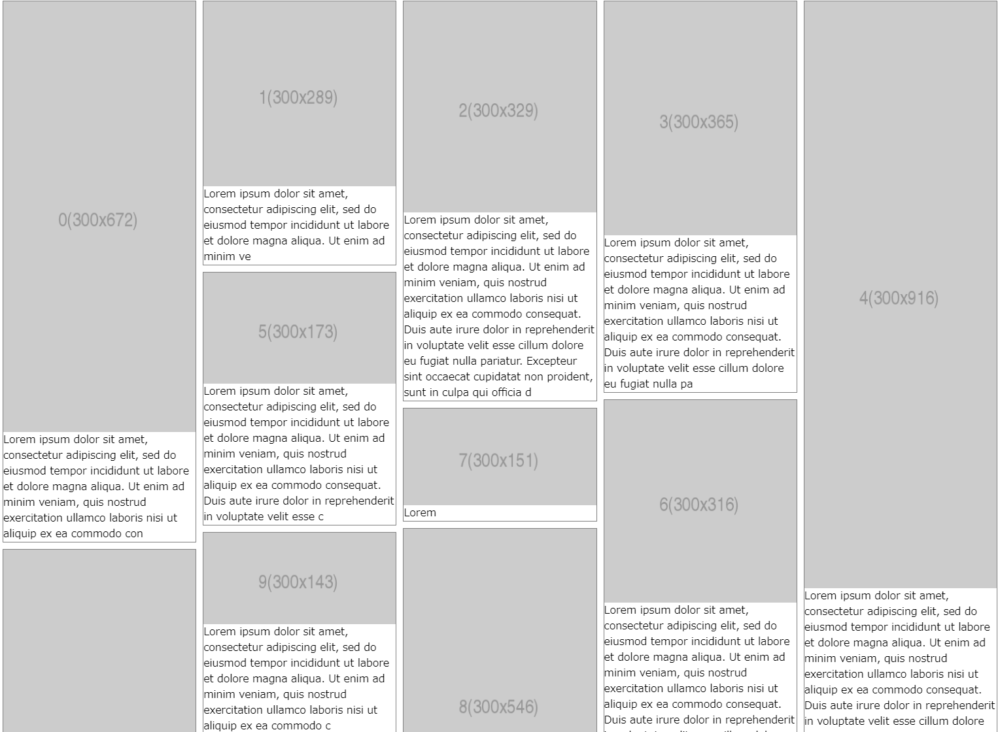

# React Masonry

Masonry layout component for React



CodeSandbox example:
https://codesandbox.io/s/mtsmfmreact-masonry-example-jeh6k

## Usage

```tsx
import * as React from "react";
import Masonry from "@mtsmfm/react-masonry";

export default function App() {
  return (
    <Masonry minColumnWidth={300} gap={10} transition="0.5s">
      {Array.from({ length: 100 }).map((_, index) => {
        const width = 300;
        const height = Math.floor(Math.random() * 1000);

        return (
          <div>
            {index}
            
          </div>
        );
      })}
    </Masonry>
  );
}
```

## Installation

```
$ npm install --save @mtsmfm/react-masonry
```
